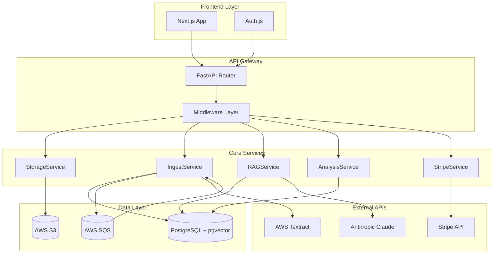
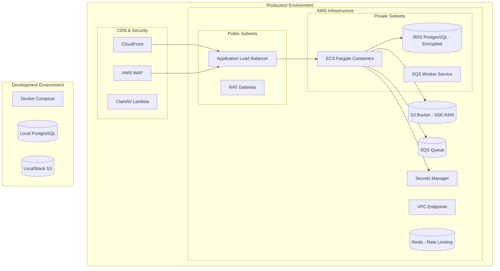

# Design Document

## Overview

LexiScan is designed as a modern, scalable AI-powered contract analysis platform built on a microservices-oriented architecture. The system leverages FastAPI for high-performance backend services, Next.js for a responsive frontend experience, and PostgreSQL with pgvector for efficient document storage and semantic search capabilities.

The platform implements a multi-tenant architecture supporting both individual users and enterprise organizations with role-based access control, flexible billing tiers, and comprehensive audit logging.

## Architecture

### High-Level Architecture



### Service Architecture

The backend follows a service-oriented design with clear separation of concerns:

1. **API Layer**: FastAPI with automatic OpenAPI documentation
2. **Service Layer**: Business logic encapsulated in dedicated services
3. **Data Access Layer**: SQLAlchemy ORM with repository pattern
4. **External Integration Layer**: Abstracted clients for third-party APIs

### Deployment Architecture



## Components and Interfaces

### Backend Services

#### StorageService
Handles secure file operations with AWS S3 integration.

**Key Methods:**
- `upload_document(file, org_id, user_id) -> DocumentUploadResponse`
- `generate_presigned_url(s3_key, expiration=3600) -> str`
- `delete_document(s3_key) -> bool`
- `get_document_metadata(s3_key) -> DocumentMetadata`

**Configuration:**
- Environment-based S3 bucket configuration
- Configurable upload size limits per billing tier
- Automatic file type validation and virus scanning

#### IngestService
Processes uploaded documents through the AI pipeline.

**Key Methods:**
- `process_document(document_id) -> ProcessingResult`
- `extract_text(s3_key, file_type) -> ExtractedText`
- `create_embeddings(text_chunks) -> List[Embedding]`
- `store_document_chunks(document_id, chunks) -> bool`

**Processing Pipeline:**
1. Text extraction using PyPDF with Tika fallback and AWS Textract only for scanned PDFs
2. Optional image cleanup (deskew, denoise) before OCR for accuracy
3. Content structuring and clause identification
4. Text chunking using LangChain RecursiveCharacterTextSplitter
5. Embedding generation (configurable: OpenAI text-embedding-3-large or AWS Bedrock)
6. Storage in PostgreSQL with pgvector indexing

#### RAGService
Implements retrieval-augmented generation for document querying.

**Key Methods:**
- `query_documents(query, document_ids, org_id) -> RAGResponse`
- `get_relevant_chunks(query, document_ids, k=10) -> List[DocumentChunk]`
- `generate_response(query, context, model="claude-3-sonnet") -> str`
- `extract_citations(response, chunks) -> List[Citation]`

**RAG Pipeline:**
1. Query embedding generation
2. Semantic similarity search using pgvector
3. Context window assembly with nearby chunks
4. Claude API integration with structured prompting
5. Citation extraction and page-level referencing

#### AnalysisService
Performs automated compliance and risk analysis.

**Key Methods:**
- `analyze_document(document_id, playbook_id) -> AnalysisResult`
- `run_compliance_checks(document_chunks, rules) -> ComplianceReport`
- `calculate_risk_score(compliance_results) -> RiskScore`
- `generate_recommendations(analysis_results) -> List[Recommendation]`

**Analysis Components:**
- Rule-based compliance engine
- Organization-specific playbook loading
- Risk scoring algorithms
- Recommendation generation system

#### StripeService
Manages billing, subscriptions, and usage tracking.

**Key Methods:**
- `create_customer(user_data) -> StripeCustomer`
- `handle_webhook(event_data) -> WebhookResponse`
- `track_usage(org_id, usage_type, amount) -> bool`
- `check_usage_limits(org_id, usage_type) -> UsageStatus`

**Billing Integration:**
- Subscription lifecycle management
- Usage-based metering for pages and tokens
- Webhook processing for real-time updates
- Plan limit enforcement

### Frontend Components

#### Core UI Components

**FileUpload.tsx**
- Drag-and-drop interface with progress tracking
- File type validation and size limits
- Upload queue management
- Error handling and retry logic

**ClauseTable.tsx**
- Sortable and filterable clause display
- Risk level indicators
- Export functionality
- Bulk selection and actions

**ChatPanel.tsx**
- Real-time RAG query interface
- Citation highlighting and navigation
- Conversation history
- Model selection (Pro/Enterprise)

**RiskScore.tsx**
- Visual risk assessment dashboard
- Compliance status indicators
- Trend analysis charts
- Drill-down capabilities

**BillingCard.tsx**
- Usage tracking and limits display
- Plan comparison and upgrade flows
- Payment method management
- Invoice history

#### API Integration Layer

**lib/api.ts**
- Centralized API client with TypeScript types
- Request/response interceptors
- Error handling and retry logic
- Authentication token management

**lib/auth.ts**
- Auth.js configuration for multiple providers
- JWT token handling
- Role-based access control
- Session management

## Data Models

### Database Schema

```sql
-- Enable required extensions
CREATE EXTENSION IF NOT EXISTS pgcrypto;
CREATE EXTENSION IF NOT EXISTS vector;

-- Organizations table
CREATE TABLE orgs (
    id UUID PRIMARY KEY DEFAULT gen_random_uuid(),
    name VARCHAR(255) NOT NULL,
    sso_config JSONB,
    created_at TIMESTAMP DEFAULT CURRENT_TIMESTAMP,
    updated_at TIMESTAMP DEFAULT CURRENT_TIMESTAMP
);

-- Users table
CREATE TABLE users (
    id UUID PRIMARY KEY DEFAULT gen_random_uuid(),
    org_id UUID REFERENCES orgs(id),
    email VARCHAR(255) UNIQUE NOT NULL,
    role VARCHAR(50) DEFAULT 'viewer',
    provider VARCHAR(50) DEFAULT 'email',
    created_at TIMESTAMP DEFAULT CURRENT_TIMESTAMP,
    last_login TIMESTAMP
);

-- Subscriptions table
CREATE TABLE subscriptions (
    id UUID PRIMARY KEY DEFAULT gen_random_uuid(),
    org_id UUID REFERENCES orgs(id),
    stripe_customer_id VARCHAR(255),
    plan VARCHAR(50) NOT NULL,
    status VARCHAR(50) DEFAULT 'active',
    usage_limits JSONB,
    created_at TIMESTAMP DEFAULT CURRENT_TIMESTAMP
);

-- Documents table
CREATE TABLE documents (
    id UUID PRIMARY KEY DEFAULT gen_random_uuid(),
    org_id UUID REFERENCES orgs(id),
    title VARCHAR(500) NOT NULL,
    s3_key VARCHAR(500) NOT NULL,
    file_type VARCHAR(50),
    file_size BIGINT,
    file_hash VARCHAR(64),
    status VARCHAR(50) DEFAULT 'uploaded',
    uploaded_by UUID REFERENCES users(id),
    created_at TIMESTAMP DEFAULT CURRENT_TIMESTAMP,
    updated_at TIMESTAMP DEFAULT CURRENT_TIMESTAMP,
    processed_at TIMESTAMP
);

-- Document chunks table with vector embeddings
CREATE TABLE document_chunks (
    id UUID PRIMARY KEY DEFAULT gen_random_uuid(),
    document_id UUID REFERENCES documents(id) ON DELETE CASCADE,
    chunk_no INTEGER NOT NULL,
    text TEXT NOT NULL,
    embedding VECTOR(1536),
    page INTEGER,
    metadata JSONB,
    created_at TIMESTAMP DEFAULT CURRENT_TIMESTAMP
);

-- Clauses table
CREATE TABLE clauses (
    id UUID PRIMARY KEY DEFAULT gen_random_uuid(),
    document_id UUID REFERENCES documents(id) ON DELETE CASCADE,
    clause_type VARCHAR(100),
    text TEXT NOT NULL,
    confidence NUMERIC(5,4),
    page INTEGER,
    risk_level VARCHAR(20),
    created_at TIMESTAMP DEFAULT CURRENT_TIMESTAMP
);

-- Analyses table
CREATE TABLE analyses (
    id UUID PRIMARY KEY DEFAULT gen_random_uuid(),
    document_id UUID REFERENCES documents(id) ON DELETE CASCADE,
    playbook_id UUID,
    risk_score INTEGER,
    summary_json JSONB,
    recommendations JSONB,
    created_at TIMESTAMP DEFAULT CURRENT_TIMESTAMP
);

-- Playbooks table
CREATE TABLE playbooks (
    id UUID PRIMARY KEY DEFAULT gen_random_uuid(),
    org_id UUID REFERENCES orgs(id),
    name VARCHAR(255) NOT NULL,
    rules_json JSONB NOT NULL,
    is_default BOOLEAN DEFAULT FALSE,
    created_at TIMESTAMP DEFAULT CURRENT_TIMESTAMP
);

-- Usage records table
CREATE TABLE usage_records (
    id UUID PRIMARY KEY DEFAULT gen_random_uuid(),
    org_id UUID REFERENCES orgs(id),
    usage_type VARCHAR(50) NOT NULL,
    amount INTEGER NOT NULL,
    period_start DATE,
    period_end DATE,
    created_at TIMESTAMP DEFAULT CURRENT_TIMESTAMP
);

-- Audit logs table
CREATE TABLE audits (
    id UUID PRIMARY KEY DEFAULT gen_random_uuid(),
    org_id UUID REFERENCES orgs(id),
    user_id UUID REFERENCES users(id),
    action VARCHAR(100) NOT NULL,
    resource_type VARCHAR(50),
    resource_id UUID,
    payload_json JSONB,
    ip_address INET,
    created_at TIMESTAMP DEFAULT CURRENT_TIMESTAMP
);

-- Indexes for performance
CREATE INDEX idx_document_chunks_embedding ON document_chunks USING ivfflat (embedding vector_cosine_ops) WITH (lists = 100);
-- At session/query time: SET ivfflat.probes = 10;

-- Foreign key indexes
CREATE INDEX idx_users_org_id ON users(org_id);
CREATE INDEX idx_subscriptions_org_id ON subscriptions(org_id);
CREATE INDEX idx_documents_org_id ON documents(org_id);
CREATE INDEX idx_documents_status ON documents(status);
CREATE INDEX idx_document_chunks_document_id ON document_chunks(document_id);
CREATE INDEX idx_clauses_document_id ON clauses(document_id);
CREATE INDEX idx_analyses_document_id ON analyses(document_id);
CREATE INDEX idx_playbooks_org_id ON playbooks(org_id);
CREATE INDEX idx_usage_records_org_period ON usage_records(org_id, period_start, period_end);
CREATE INDEX idx_audits_org_created ON audits(org_id, created_at);

-- Unique constraints
CREATE UNIQUE INDEX ux_document_chunks_doc_chunk ON document_chunks(document_id, chunk_no);
CREATE UNIQUE INDEX ux_documents_org_hash ON documents(org_id, file_hash);
CREATE UNIQUE INDEX ux_events_stripe_id ON audits ((payload_json->>'stripe_event_id')) WHERE payload_json->>'stripe_event_id' IS NOT NULL;

-- Row Level Security for multi-tenancy
ALTER TABLE orgs ENABLE ROW LEVEL SECURITY;
ALTER TABLE users ENABLE ROW LEVEL SECURITY;
ALTER TABLE documents ENABLE ROW LEVEL SECURITY;
ALTER TABLE document_chunks ENABLE ROW LEVEL SECURITY;
ALTER TABLE clauses ENABLE ROW LEVEL SECURITY;
ALTER TABLE analyses ENABLE ROW LEVEL SECURITY;
ALTER TABLE playbooks ENABLE ROW LEVEL SECURITY;
ALTER TABLE usage_records ENABLE ROW LEVEL SECURITY;
ALTER TABLE audits ENABLE ROW LEVEL SECURITY;

-- RLS Policies
CREATE POLICY documents_org_rls ON documents USING (org_id::text = current_setting('app.current_org', true));
CREATE POLICY document_chunks_org_rls ON document_chunks USING (
    (SELECT org_id FROM documents WHERE id = document_id)::text = current_setting('app.current_org', true)
);
CREATE POLICY clauses_org_rls ON clauses USING (
    (SELECT org_id FROM documents WHERE id = document_id)::text = current_setting('app.current_org', true)
);
CREATE POLICY analyses_org_rls ON analyses USING (
    (SELECT org_id FROM documents WHERE id = document_id)::text = current_setting('app.current_org', true)
);
CREATE POLICY playbooks_org_rls ON playbooks USING (org_id::text = current_setting('app.current_org', true));
CREATE POLICY usage_records_org_rls ON usage_records USING (org_id::text = current_setting('app.current_org', true));
CREATE POLICY audits_org_rls ON audits USING (org_id::text = current_setting('app.current_org', true));
```

### API Data Models

**DocumentUploadResponse**
```typescript
interface DocumentUploadResponse {
  document_id: string;
  s3_key: string;
  upload_url: string;
  status: 'uploaded' | 'processing' | 'completed' | 'failed';
}
```

**RAGResponse**
```typescript
interface RAGResponse {
  answer: string;
  citations: Citation[];
  confidence: number;
  model_used: string;
  processing_time: number;
}

interface Citation {
  document_id: string;
  page: number;
  chunk_id: string;
  text: string;
  relevance_score: number;
}
```

**AnalysisResult**
```typescript
interface AnalysisResult {
  document_id: string;
  risk_score: number;
  compliance_status: 'compliant' | 'non_compliant' | 'review_required';
  missing_clauses: string[];
  recommendations: Recommendation[];
  clause_analysis: ClauseAnalysis[];
}
```

## Error Handling

### Error Classification

1. **Client Errors (4xx)**
   - Authentication failures
   - Authorization violations
   - Validation errors
   - Rate limiting

2. **Server Errors (5xx)**
   - Service unavailability
   - External API failures
   - Database connection issues
   - Processing timeouts

3. **Business Logic Errors**
   - Usage limit exceeded
   - Unsupported file types
   - Processing failures
   - Billing issues

### Error Response Format

```typescript
interface ErrorResponse {
  error: {
    code: string;
    message: string;
    details?: any;
    request_id: string;
    timestamp: string;
  };
}
```

### Retry and Resilience Patterns

- **Circuit Breaker**: For external API calls (Claude, Stripe, AWS)
- **Exponential Backoff**: For webhook delivery and queue processing
- **Graceful Degradation**: Fallback to basic text extraction if AI services fail
- **Dead Letter Queues**: For failed processing jobs
- **Webhook Idempotency**: Store Stripe event IDs to prevent duplicate processing
- **Rate Limiting**: Redis-backed limits per user and organization
- **Security Scanning**: ClamAV antivirus scan before document ingestion

### Authentication and Session Management

- **JWT Strategy**: Short-lived access tokens with refresh token rotation
- **Key Management**: Signing keys rotated via AWS Secrets Manager
- **CSRF Protection**: Implemented for NextAuth credential flows
- **Multi-tenant Isolation**: Row Level Security policies enforce org boundaries

### Security and Networking

- **Network Isolation**: RDS and ECS tasks in private subnets with NAT Gateway
- **Encryption**: SSE-KMS on S3, RDS encryption at rest and in transit
- **Access Control**: S3 presigned URLs with TTL limits and content-type restrictions
- **VPC Endpoints**: Private access to S3 and SQS services
- **File Upload Security**: Size limits, type validation, and malware scanning

### Observability and Monitoring

- **Distributed Tracing**: OpenTelemetry traces across frontend → API → services
- **Health Checks**: Readiness and liveness probes for ECS containers
- **Metrics**: Custom CloudWatch metrics for business KPIs
- **Alerting**: Automated alerts for system health and usage thresholds

## Testing Strategy

### Backend Testing

**Unit Tests**
- Service layer business logic
- Data access layer operations
- Utility functions and helpers
- Mock external dependencies

**Integration Tests**
- API endpoint functionality
- Database operations with test fixtures
- External service integrations
- Authentication and authorization flows

**Performance Tests**
- Load testing for document processing
- Concurrent user simulation
- Database query optimization
- Memory usage profiling

### Frontend Testing

**Component Tests**
- React component rendering
- User interaction handling
- State management
- API integration

**End-to-End Tests**
- Complete user workflows
- Cross-browser compatibility
- Mobile responsiveness
- Accessibility compliance

### Testing Infrastructure

- **Test Database**: Isolated PostgreSQL instance with pgvector
- **Mock Services**: Stubbed external APIs for consistent testing
- **CI/CD Pipeline**: Automated testing on pull requests
- **Test Data Management**: Fixtures and factories for consistent test data

### Security Testing

- **Authentication Testing**: JWT validation, session management
- **Authorization Testing**: Role-based access control
- **Input Validation**: SQL injection, XSS prevention
- **File Upload Security**: Malware scanning, type validation
- **API Security**: Rate limiting, CORS configuration

This design provides a robust foundation for building LexiScan with clear separation of concerns, scalable architecture, and comprehensive error handling while maintaining security and performance requirements.
##
 Configuration Management

### Environment-Based Configuration

**Provider Selection:**
- `EMBEDDING_PROVIDER`: "openai" or "bedrock"
- `LLM_PROVIDER`: "anthropic" or "bedrock"
- `USE_BEDROCK`: Boolean flag for single-vendor hosting

**Database Configuration:**
- Connection pooling with SQLAlchemy
- Read replicas for analytics queries
- Automated backups and point-in-time recovery

**Queue Configuration:**
- Separate worker service (Celery or Lambda) for SQS processing
- Dead letter queues for failed jobs
- Visibility timeout and retry policies

## Optional Enhancements

### Document Viewer Service
- Render page images with highlight overlays for citations
- PDF annotation and redaction capabilities
- Real-time collaboration features

### Playbook Versioning
- Version control for compliance rules
- Audit trail for playbook changes
- Reproducible analysis results

### Tenant Data Residency
- Regional routing for storage and compute
- Compliance with data sovereignty requirements
- Multi-region deployment support

### Async Export Service
- Generate PDF/Word reports via background queue
- Avoid API timeouts for large documents
- Email delivery of completed reports

### Advanced Analytics
- Usage pattern analysis
- Risk trend identification
- Compliance benchmarking across organizations